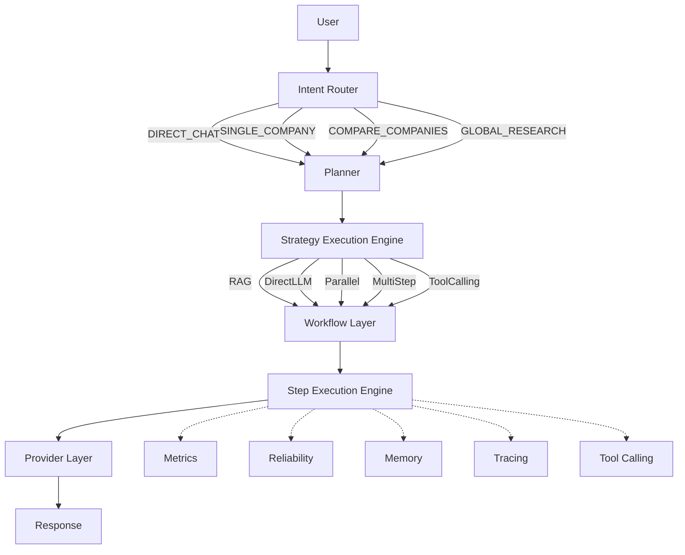

# Financial Agent Runtime Assistant V8.1.0

[](https://github.com/csl1234213/financial-rag-assistant/actions/workflows/ci.yml)
[](https://github.com/csl1234213/financial-rag-assistant)
[](https://www.python.org/)
[](LICENSE)
[](https://github.com/csl1234213/financial-rag-assistant/actions/workflows/ci.yml)

## AI-Powered Financial Agent Runtime for Multi-Document Research

---

## Project Overview

Financial Agent Runtime Assistant is a **production-grade AI Agent framework** designed for financial document analysis.

Unlike traditional RAG demos, this project implements a **full Agent Runtime architecture** with Intent Routing, Workflow Orchestration, Layered Execution, and Pluggable Runtime Capabilities.

### Core Capabilities

- **Direct Chat Workflow** — Non-research queries routed to direct LLM conversation
- **Financial RAG Workflow** — Evidence-backed research reports with citations
- **Intent Routing** — Automatic classification: Direct Chat / Single Company / Compare Companies / Global Research
- **Workflow Orchestration** — Strategy-driven execution: RAG / DirectLLM / Parallel / MultiStep / ToolCalling
- **LLM Provider Abstraction** — Factory pattern with pluggable providers (DeepSeek, Gemini)
- **Pluggable Runtime Capabilities** — Memory, Metrics, Reliability, Tracing, Tool Calling
- **LangGraph Orchestration** — Source-controlled plan, execute, and finalize graph
- **Tenant-Safe Tool Use** — Governed retrieval contract with explicit tenant scope
- **MCP Foundation** — Lifecycle-aware stdio JSON-RPC, schemas, allowlists, and authorization hooks
- **Evaluation & Prompt Governance** — Versioned prompts, golden datasets, RAG/Agent metrics, and model benchmarks
- **LoRA Readiness** — Validated SFT data and an explicit, opt-in Hugging Face training path

---

## Capability Matrix

### Production

| Feature | Status | Description |
|---|---|---|
| Direct Chat | Production | Non-research queries routed to direct LLM conversation |
| Financial RAG Workflow | Production | Evidence-backed research reports with citations |
| DeepSeek Provider | Production | Primary LLM provider via ProviderFactory |
| Agent Runtime | Production | Full lifecycle: Intent → Planning → Workflow → Execution → Provider |

### Supported

| Feature | Status | Description |
|---|---|---|
| Gemini Provider | Supported | Registered in ProviderRegistry, 95-line implementation |

### Framework Ready (Plug-and-Play)

| Feature | Status | Description |
|---|---|---|
| Memory | Framework Ready | Retrieve + Store lifecycle hooks, injectable via `memory_engine` |
| Metrics | Framework Ready | `runtime_duration`, `workflow_duration`, `estimated_tokens`, injectable via `metric_engine` |
| Reliability | Framework Ready | Retry, Timeout, CircuitBreaker, HealthCheck, RateLimiter, Fallback |
| Tracing | Framework Ready | Console/File/Memory tracers with TraceRegistry |
| Tool Calling | Framework Ready | ToolEngine + ToolCallingStrategy + ToolCallingHandler |

---

## Architecture Overview



### Pipeline Flow

```
                          User
                           │
                           ▼
                    Intent Router
                    (DIRECT_CHAT / SINGLE_COMPANY / COMPARE / GLOBAL)
                           │
                           ▼
                         Planner
                    (TaskAnalyzer + ComplexityAnalyzer)
                           │
                           ▼
                    Strategy Execution Engine
                    (RAG / DirectLLM / Parallel / MultiStep / ToolCalling)
                           │
                           ▼
                      Workflow Layer
                    (WorkflowEngine + WorkflowExecutor)
                           │
                           ▼
                    Step Execution Engine
                    (Handler dispatch + dependency resolution)
                           │
                           ▼
                      Provider Layer
                    (ProviderFactory + ProviderRegistry)
                           │
                           ▼
                        Response
```

### Execution Layer Design

The project uses a **dual-engine execution architecture**:

| Layer | Engine | Responsibility |
|---|---|---|
| Strategy Layer | `agent/execution/execution_engine.py` | **How to execute?** Selects strategy (RAG / DirectLLM / Parallel / MultiStep) |
| Step Layer | `agent/execution_engine.py` | **Execute each step.** Dispatches to registered handlers |

This design separates strategic decision-making from step-level execution, enabling independent evolution of both layers.

---

## Tech Stack

| Category | Technology |
|---|---|
| Language | Python 3.11 |
| API Framework | FastAPI |
| Vector Database | ChromaDB |
| LLM Provider | DeepSeek (primary), Gemini (supported) |
| Agent Runtime | LangGraph orchestration + custom financial domain runtime |
| AI Evaluation | Versioned golden datasets + deterministic RAG/Agent/model metrics |
| Testing | pytest with an 85% CI coverage gate |
| UI | React + TypeScript + Vite (development); Nginx static serving (Docker) |

---

## Runtime and Operations

**The V8.1.0 canonical deployment entry point is the repository-root
[`docker-compose.yml`](docker-compose.yml).** It runs the React/Nginx frontend,
FastAPI API, `agent-worker`, PostgreSQL, Redis, and ChromaDB together.

- [Current architecture](docs/ARCHITECTURE.md)
- [Deployment topology](docs/DEPLOYMENT_ARCHITECTURE.md)
- [Operational runbook](docs/OPERATIONS.md)
- [AI engineering and extension guide](docs/AI_ENGINEERING_GUIDE.md)
- [V8.1.0 release record](docs/releases/v8.1.0.md)
- [V7.3.3 release record](docs/releases/v7.3.3.md)

The files under `deploy/`, the Streamlit Dockerfile, and historical release
documents are retained for reference. They are not the V8.1.0 startup path.

---

## Quick Start

```bash
# 1. Clone the repository
git clone https://github.com/csl1234213/financial-rag-assistant.git
cd financial-rag-assistant

# 2. Create a local runtime configuration; never commit this file.
cp .env.example .env
# Edit .env: set AUTH_SECRET_KEY, POSTGRES_PASSWORD, REDIS_PASSWORD, and
# DEEPSEEK_API_KEY. Root Compose constructs its internal database URLs.

# 3. Build and start the canonical V8.1.0 stack.
docker compose up -d --build

# 4. Open in browser
#    Copilot: http://localhost:3000
#    API:     http://localhost:8000
#    Swagger: http://localhost:8000/docs
```

**Prerequisites:** Docker Desktop (or Docker Engine + Docker Compose)

**Windows (PowerShell):**
```powershell
Copy-Item .env.example .env
# Edit .env before starting.
docker compose up -d --build
```

For the React/Vite development workflow (`http://localhost:5173`), follow
[the runbook](docs/OPERATIONS.md#reactvite-development) and set
`VITE_API_BASE_URL=/api` in `frontend/.env`; Vite proxies that prefix to the
local FastAPI service.

---

## API Endpoints

| Endpoint | Method | Description |
|---|---|---|
| `/api/v1/chat` | POST | Financial research chat |
| `/api/v1/knowledge` | GET | Knowledge base overview |
| `/api/v1/knowledge/statistics` | GET | Document & chunk statistics |
| `/api/v1/upload` | POST | Upload a PDF and enqueue asynchronous indexing |
| `/api/v1/refresh` | POST | Rebuild public demo knowledge (admin/owner only) |
| `/api/v1/health` | GET | System health check |

---

## Project Structure

```
financial-rag-assistant/
├── agent/
│   ├── agent_runtime.py          # Unified lifecycle manager
│   ├── execution_engine.py       # Step Execution Engine (handler dispatch)
│   ├── execution_plan.py         # PlanStep / ExecutionPlan structures
│   ├── execution_result.py       # Step execution result
│   ├── query_planner.py          # Intent → ExecutionPlan
│   ├── reasoning_engine.py       # Evidence → Facts / Risks / Opportunities
│   ├── reasoning_models.py       # Evidence + ReasoningResult
│   ├── runtime_context.py        # Runtime state
│   ├── runtime_result.py         # Unified output
│   ├── runtime_state.py          # Reliability state tracking
│   ├── execution/                # Strategy Execution Engine
│   │   ├── execution_engine.py   # Strategy selection (RAG/DirectLLM/Parallel)
│   │   ├── execution_context.py
│   │   ├── execution_result.py
│   │   └── strategies/           # RAG, DirectLLM, Parallel, MultiStep, ToolCalling
│   ├── workflow/                 # Workflow Engine + Executor
│   ├── planning/                 # TaskAnalyzer, ComplexityAnalyzer, Routing
│   ├── memory/                   # Memory Engine (Framework Ready)
│   ├── metrics/                  # Metrics Engine (Framework Ready)
│   ├── reliability/              # Reliability Engine (Framework Ready)
│   ├── tracing/                  # Tracing Engine (Framework Ready)
│   └── tools/                    # Tool Engine (Framework Ready)
├── core/
│   ├── core_engine.py            # Main entry point (run_rag)
│   ├── intent_analyzer.py        # Intent classification
│   ├── context_builder.py        # Evidence → structured context
│   ├── knowledge_manager.py      # Knowledge source management
│   ├── report_builder.py         # Structured research report
│   └── citation_formatter.py     # Citation formatting
├── llm/
│   ├── provider.py               # Bridge adapter (ProviderFactory + call_llm)
│   ├── adapters/                 # Provider implementations
│   │   ├── deepseek_provider.py  # DeepSeek (Production)
│   │   ├── gemini_provider.py    # Gemini (Supported)
│   │   ├── azure_provider.py     # Azure (Reserved)
│   │   └── claude_provider.py    # Claude (Reserved)
│   ├── factory/                  # ProviderFactory
│   └── router/                   # ModelRouter
├── retrieval/
│   └── hybrid_retriever.py       # Semantic search + ranking
├── api/
│   ├── main.py                   # FastAPI entry point
│   ├── routers/                  # API route handlers
│   ├── services/                 # Business logic layer
│   └── schemas/                  # Pydantic request/response models
├── config/                       # Centralized configuration
├── tests/
│   ├── test_intent_analyzer.py
│   ├── planning/                 # Intent router regression matrix
│   └── e2e/                      # End-to-end tests
└── docs/                         # Architecture & deployment docs
```

---

## System Evolution

```
V1    → PDF QA Prototype
V2    → Multi-document RAG
V2.1  → Router Experiment (removed)
V2.2  → Stable Architecture
V3.0  → Agent Runtime Edition
V4.0  → Production Architecture
V7.3.1 → Agent Runtime Framework
V7.3.2 → Docker Production Packaging
V7.3.3 → Demo Knowledge Bootstrap
V8.1.0 → Production Agent Platform
```

---

## Key Engineering Highlights

### 1. Agent Runtime Architecture

Unlike traditional RAG pipelines, this project implements a full Agent Runtime with:
- **Query Planning** — Structured execution plans with DAG dependencies
- **Dual Execution Engine** — Strategy selection + Step dispatch
- **Runtime Context** — Unified state management for one Agent execution
- **Structured Reasoning** — Facts / Risks / Opportunities extraction
- **Explainable Evidence Pipeline** — Every output traceable to source documents

### 2. LLM Provider Abstraction

Factory pattern with pluggable providers:
- `ProviderFactory.create(config)` → `ProviderRegistry.get(name)` → `BaseProvider.chat()`
- DeepSeek (Production) and Gemini (Supported) providers
- Clean separation between SDK calls and business logic

### 3. Pluggable Runtime Capabilities

Memory, Metrics, Reliability, Tracing, and Tool Calling are **fully implemented** and **ready to activate** by injecting engine instances into `AgentRuntime`. The runtime gracefully degrades when engines are not provided.

### 4. Evidence-Based Output

Every answer must be traceable to source documents. The system provides:
- Answer
- Evidence
- Source documents
- Reasoning trace

---

## Demo Showcase

### Docker Quick Demo

```bash
$ docker compose up
```

```
=== Financial Agent Runtime Assistant v8.1.0 ===
[Entrypoint] Running knowledge bootstrap...
[Bootstrap] Knowledge base empty — initializing demo data...
Loaded Documents: 5 (Tesla, NVIDIA, Apple)
Total Chunks: 257
[Bootstrap] Done — 257 chunks indexed.
[Entrypoint] Starting API server...
```

**Health Check:**
```json
{
  "status": "ok",
  "service": "Financial Research Copilot",
  "version": "8.1.0",
  "api": "ok",
  "runtime": "ok",
  "embedding_model": "loaded",
  "documents": 5
}
```

> First run auto-bootstraps demo knowledge base with Tesla, NVIDIA, Apple financial PDFs.  
> Subsequent runs skip init (idempotent). `docker compose down` persists data in named volumes.

---

### Direct Chat

```
Request: POST /api/v1/chat
Body: {"question": "What is AI?", "stream": false}
```

Response:
```json
{
  "workflow": {"type": "direct_chat"},
  "reasoning": {"intent": "DIRECT_CHAT", "companies": null, "evidence_count": 0},
  "execution": {"strategy": "direct_llm", "use_retrieval": false},
  "routing": {"provider": "deepseek", "model": "deepseek-chat"},
  "report": "Artificial Intelligence (AI) is..."
}
```

> No retrieval, no citations — direct LLM conversation. Intent Router classifies as `DIRECT_CHAT`.

---

### Financial RAG Research

```
Request: POST /api/v1/chat
Body: {"question": "Analyze Tesla revenue growth", "stream": false}
```

Response:
```json
{
  "workflow": {"type": "rag"},
  "reasoning": {"intent": "SINGLE_COMPANY", "companies": ["Tesla"], "evidence_count": 4},
  "execution": {"strategy": "rag", "use_retrieval": true},
  "citations": [
    {"source": "Tesla_Q2_2025.pdf", "similarity": 0.97, "preview": "Total revenues 94,827 -3%..."},
    {"source": "Tesla_Q2_2025.pdf", "similarity": 0.92, "preview": "Automotive revenues 69,526 -10%..."},
    {"source": "Tesla_Q2_2025.pdf", "similarity": 0.90, "preview": "Energy generation and storage revenue..."},
    {"source": "Tesla_Q2_2025.pdf", "similarity": 0.86, "preview": "results of operations..."}
  ],
  "report": "# Research Report\n\n## Summary\n..."
}
```

> Evidence-backed research with 4 citations from `Tesla_Q2_2025.pdf`.  
> Intent Router classifies as `SINGLE_COMPANY`, Strategy Engine selects `rag`.

---

### Swagger API

FastAPI auto-generated API documentation at `/docs`:

| Endpoint | Method | Description |
|---|---|---|
| `/api/v1/chat` | POST | Financial research chat |
| `/api/v1/knowledge` | GET | Knowledge base overview |
| `/api/v1/upload` | POST | Upload PDF documents |
| `/api/v1/health` | GET | System health check (`APP_VERSION: "8.1.0"`) |

> Full demo script: [docs/demo/demo-script.md](docs/demo/demo-script.md)

---

## Screenshots

| Screenshot | Description |
|---|---|
|  | `docker compose up` — Bootstrap 5 PDFs, 257 chunks indexed, both services healthy |
|  | `GET /api/v1/health` — All systems operational, embedding model loaded |
|  | `POST /api/v1/chat` — Tesla RAG research with 4 citations from `Tesla_Q2_2025.pdf` |
|  | Historical Streamlit UI screenshot; the supported V8.1.0 UI is React at `:3000` in Docker or Vite at `:5173` in development. |

---

## Design Philosophy

> Simplicity improves reliability more than complexity improves intelligence.

> Built not to answer questions, but to support financial reasoning.
