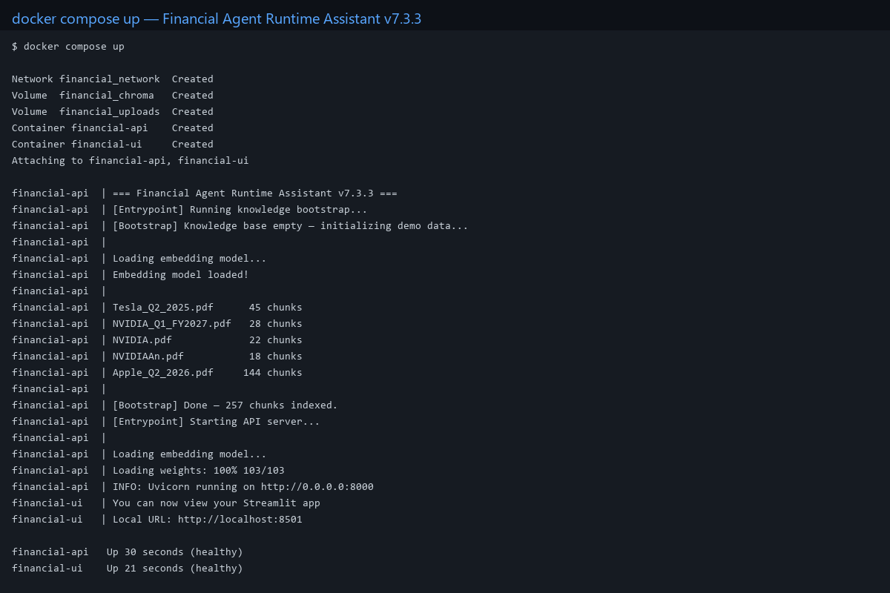
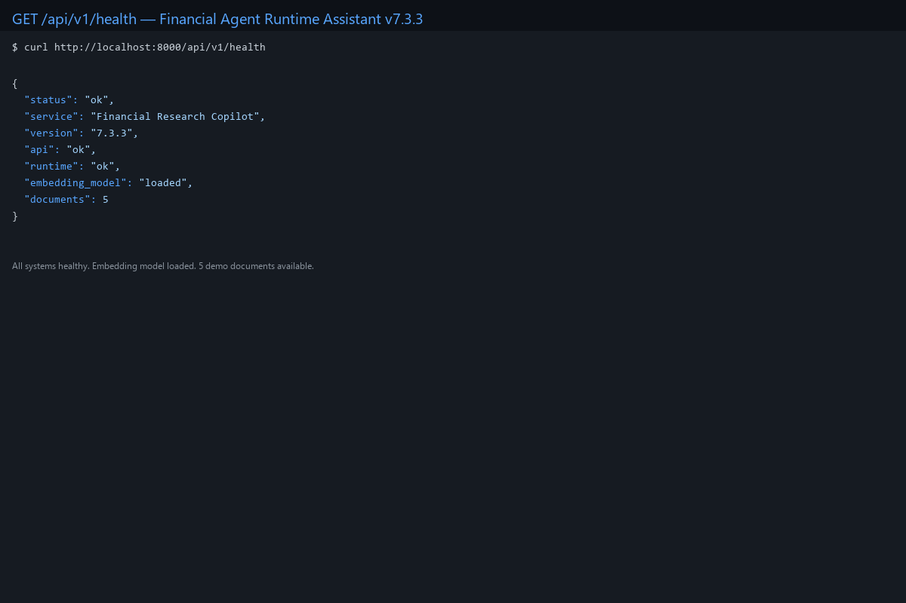
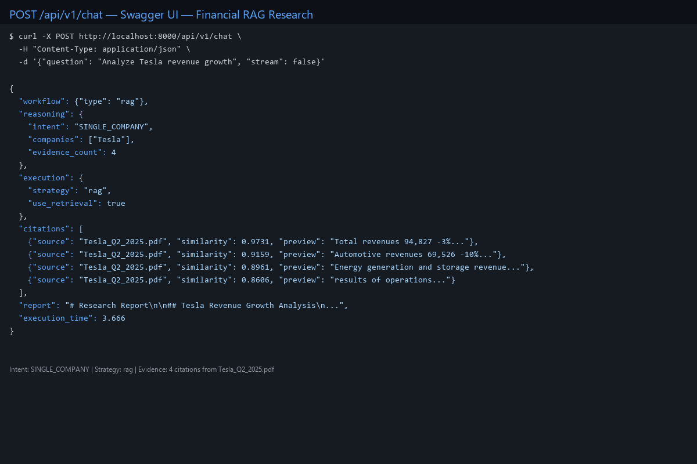
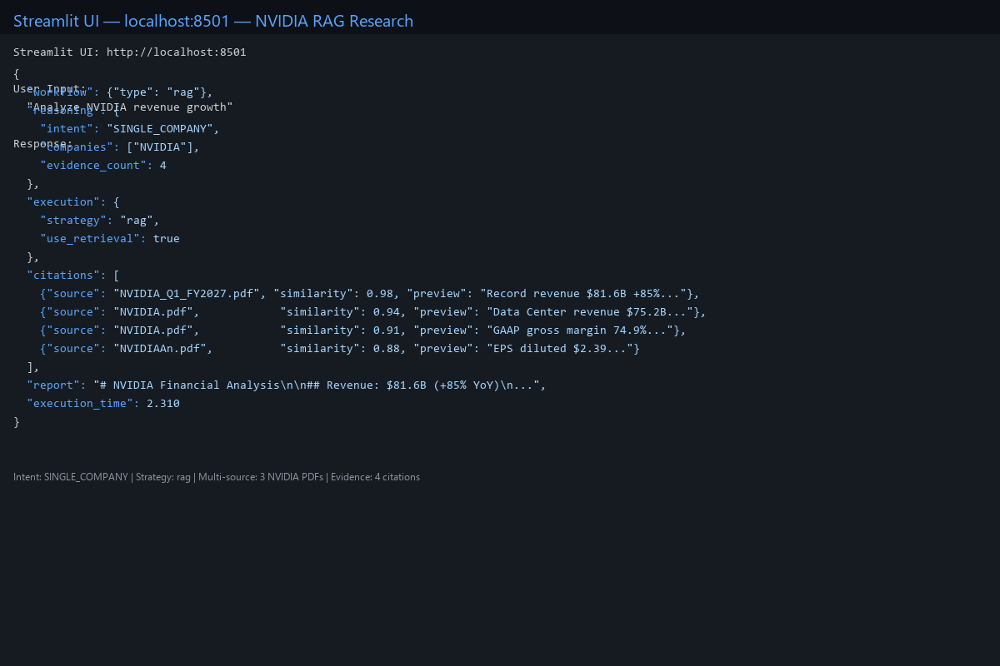

# Financial Agent Runtime Assistant V8.2.0

**语言：** [English](README.md) | **简体中文**

**金融 AI Copilot · 财报与金融文档研究工具**

面向财报和金融文档的研究工具。上传资料后，系统可以检索相关内容、整理结构化财务数据，并在回答中保留来源信息。重要数据仍需对照原文核验。

[](https://github.com/csl1234213/financial-rag-assistant/actions/workflows/ci.yml)
[](https://www.python.org/)
[](https://fastapi.tiangolo.com/)
[](https://react.dev/)
[](https://www.docker.com/)
[](https://github.com/csl1234213/financial-rag-assistant)
[](LICENSE)

---

## 产品概述

### 解决什么问题

用户需要从年报、季报及其他金融文件中查找数值、核对期间和比较公司数据。普通文本切块可能打散表格关系；只依赖关键词或向量相似度，也可能漏掉使用不同术语表达的同一项指标。Financial Agent Runtime Assistant（Financial AI Copilot）围绕文档证据检索和财务数据结构化处理这些问题：

- **Agentic RAG** — AI Agent 规划研究工作流、检索相关证据、生成带引用的答案
- **混合检索** — 结合语义理解与关键词匹配，实现精准文档搜索
- **来源引用** — 答案可附带检索到的来源与相关度信息，便于回到文档核查
- **用户与工作空间** — 使用账号登录，文档、向量和任务按所属工作空间控制访问

### 目标用户

- **金融分析师** — 研究公司、比较业绩、分析趋势
- **投资团队** — 在授权的工作空间中共享财报和研究资料
- **AI 工程师** — 生产级 RAG 系统的参考架构

### 核心价值

> 将金融文档整理为可检索的内容和结构化事实，并保留来源以便复核。

新注册账号目前加入默认工作空间。同一工作空间中的账号共享该空间资料；当前实现不提供每个账号独立的私有知识库。

### 面向的财报 RAG 难点

通用文档问答常把财报当作普通文本处理。表格拆成分块后，指标、数值、单位、期间和合并范围可能失去对应关系；用户的说法也常与报表行名不同，检索便容易漏掉本来存在的数据。即使召回了相关内容，如果答案没有继续校验公司、报告期和来源，引用也未必真正支撑结论。

本项目围绕这条证据链处理这些问题：

- 从财报表格重建带行列、期间、单位、范围和页码信息的结构化记录，并区分结构可信度与指标语义映射状态。
- 用集中式指标注册表保守地把报表行名归一为标准指标；无法确定时保留未映射状态，避免把“货币资金”折叠成“现金及现金等价物”等不同口径。
- 将经过校验的财务记录按公司、报告期间、合并范围和来源定位保存，支持可审计的检索，并对重复写入和冲突值采取明确处理。
- 在查询规划阶段识别结构化财务问题，让系统可以按指标及期间查找证据，而不只依赖文本相似度。
- 对没有可用来源的公司问题，可通过 SEC EDGAR 或巨潮资讯网（CNINFO）官方报告发现流程下载资料，并交由原有文档入库链路处理。
- 聊天接口支持 SSE 分段返回，但只在完整回答通过 grounding 和 sanitizer 后发送，避免未经校验的财务结论提前展示；普通 JSON 响应仍兼容。

当前验证重点是贵州茅台 2025 年报中的标准财务报表样本。该结果不能代表所有发行人、所有 PDF 版式、附注表格或跨语言场景均已覆盖。项目说明和阶段审计见[金融财报 RAG 的问题范围与验证边界](docs/FINANCIAL_RAG_PROBLEM_STATEMENT.md)。

### 当前财报 RAG 阶段：P1.7

当前阶段将经过结构校验的报表行、保守的标准指标映射和带来源信息的财务事实连接到结构化查询路由。事实记录保留公司、报告期间、报表范围、单位和来源位置。验证目前以贵州茅台 2025 年报为重点，不代表已覆盖所有发行人或财报版式。SEC EDGAR 与巨潮资讯网（CNINFO）的官方报告发现流程为可选能力，实际可用性取决于官方来源访问情况及运行配置。

---

## 演示工作流

1. **注册** 账号 → 进入默认工作空间
2. **上传** 财报 PDF → 后台 Worker 自动处理文档
3. **提问** 金融问题 → Agent 规划研究工作流
4. **获取** 带引用的答案 → 每条声明可追溯到源文档

```
注册 → 上传 PDF → Worker 处理 → 提问 → 带引用的答案
```

---

## 功能特性

### 🤖 AI 研究 Agent

智能 Agent 理解金融查询并执行多步骤研究工作流。

- **意图分析器** — 自动分类查询：直接对话 / 单公司分析 / 公司对比 / 全局研究
- **查询规划器** — 生成带依赖解析的结构化执行计划
- **Agent Runtime** — 全生命周期编排：意图 → 规划 → 工作流 → 执行
- **多策略执行** — RAG、直接 LLM、并行、多步骤、工具调用等策略

### 📚 知识工作空间

上传、索引和管理金融文档，完整的文档生命周期。

- **PDF 上传** — 拖拽上传财报，自动处理
- **文档索引** — 使用 sentence-transformers 自动分块和嵌入
- **分块浏览器** — 浏览和检查文档分块及其元数据
- **向量存储** — 持久化 ChromaDB 向量数据库，支持混合搜索

### 🔎 检索调试台

交互式工具调试和分析检索质量。

- **混合搜索** — 语义 + 关键词检索，可配置权重
- **相似度评分** — 每个检索到的分块透明展示相关性分数
- **检索调试** — 检查查询嵌入、搜索结果和排名

### 📑 引用系统

每项研究输出都可追溯到源文档。

- **证据追踪** — 每条声明链接到特定文档分块
- **源引用** — 完整来源标注，包含文档名和页面上下文
- **置信度分数** — 每个引用基于相似度的置信度

---

## 生产特性

| 特性 | 实现 |
|---------|---------------|
| **用户与工作空间权限** | JWT 识别用户；文档、向量和任务按工作空间范围访问 |
| **异步任务处理** | Redis Streams + Worker Pool（水平扩展、自动重试、心跳检测） |
| **向量搜索** | ChromaDB + 混合检索（语义 + 关键词） |
| **AI 生成** | 加密 BYOK 多模型抽象层（DeepSeek / Gemini / OpenAI / Anthropic / 豆包 / 本地 Ollama） |
| **本地模型** | 可配置 Ollama 服务地址和模型标签；Provider 外呼由运行策略控制 |
| **Agent Runtime** | 意图分析器 → 查询规划器 → 策略引擎 → 工作流执行器 |
| **部署** | Docker Compose（6 个服务：frontend, backend, agent-worker, postgres, redis, chromadb） |
| **CI/CD** | GitHub Actions（Ruff、pytest、覆盖率、前端测试/构建、Compose 构建） |
| **API 文档** | 自动生成 OpenAPI（Swagger UI） |

---

## 系统架构

```
                    ┌─────────────────┐
                    │      用户       │
                    └────────┬────────┘
                             │
                             ▼
                    ┌─────────────────┐
                    │  React 前端      │  (Vite + TypeScript + Nginx)
                    └────────┬────────┘
                             │
                             ▼
                    ┌─────────────────┐
                    │  FastAPI 网关    │  (REST API + JWT 认证)
                    └────────┬────────┘
                             │
                             ▼
                    ┌─────────────────┐
                    │  Agent Runtime   │
                    ├─────────────────┤
                    │ 意图分析器       │
                    │ 查询规划器       │
                    │ 策略引擎         │
                    │ 工作流执行器     │
                    └────────┬────────┘
                             │
                             ▼
                    ┌─────────────────┐
                    │ 混合检索器       │  (语义 + 关键词)
                    └────────┬────────┘
                             │
                    ┌────────┴────────┐
                    ▼                 ▼
            ┌──────────────┐  ┌──────────────┐
            │  ChromaDB     │  │  LLM Provider │
            │  (向量数据库)  │  │  (DeepSeek)   │
            └──────────────┘  └──────────────┘
```

### 异步任务管道

```
PDF 上传
    │
    ▼
任务数据库 (PostgreSQL)
    │
    ▼
Redis Streams (消息队列)
    │
    ▼
Worker Pool (水平扩展)
    │
    ▼
文档处理 → 嵌入 → 向量存储 (ChromaDB)
```

### 基础设施

```
┌──────────────────────────────────────────────────────────────────────────┐
│                              Docker Compose                               │
├──────────┬──────────┬──────────────┬────────────┬──────────┬────────────┤
│ frontend │ backend  │ agent-worker │ PostgreSQL │ Redis    │ ChromaDB   │
│ :3000    │ :8000    │ 异步任务处理  │ :5432      │ :6379    │ :8001      │
└──────────┴──────────┴──────────────┴────────────┴──────────┴────────────┘
```

---

## 支持的 LLM 提供商

| 提供商 | 状态 | 说明 |
|----------|--------|-------------|
| DeepSeek | 已支持 | OpenAI 兼容接口，可在设置页选择模型 |
| Gemini | 已支持 | Google Gemini 适配器与用户级配置 |
| OpenAI | 已支持 | OpenAI 适配器与用户级配置 |
| Anthropic Claude | 已支持 | Anthropic 适配器与用户级配置 |
| 豆包（Doubao） | 已支持 | 火山引擎兼容适配器与用户级配置 |
| Ollama | 已支持 | 可连接用户配置的本地服务地址和模型标签 |

API Key 由登录用户在设置页保存，后端加密存储；仓库不附带任何真实凭据。

---

## 演示

### 截图

| 截图 | 说明 |
|---|---|
|  | Docker Compose 启动与知识库初始化 |
|  | FastAPI 健康检查结果 |
|  | Swagger 中的带引用 RAG 请求 |
|  | 历史 Streamlit 原型；当前正式界面为 React |

### API 演示

**直接对话** — 非研究类查询路由到直接 LLM 对话：

```json
// POST /api/v1/chat
{ "question": "什么是 AI？", "stream": false }

// 响应
{
  "workflow": { "type": "direct_chat" },
  "reasoning": { "intent": "DIRECT_CHAT", "evidence_count": 0 },
  "execution": { "strategy": "direct_llm", "use_retrieval": false },
  "report": "人工智能（AI）是..."
}
```

**金融 RAG 研究** — 带证据和引用的研究：

```json
// POST /api/v1/chat
{ "question": "分析特斯拉的收入增长", "stream": false }

// 响应
{
  "workflow": { "type": "rag" },
  "reasoning": { "intent": "SINGLE_COMPANY", "companies": ["特斯拉"], "evidence_count": 4 },
  "execution": { "strategy": "rag", "use_retrieval": true },
  "citations": [
    { "source": "Tesla_Q2_2025.pdf", "similarity": 0.97, "preview": "总收入..." },
    { "source": "Tesla_Q2_2025.pdf", "similarity": 0.92, "preview": "汽车业务收入..." }
  ],
  "report": "# 研究报告\n\n## 摘要\n..."
}
```

---

## 快速开始

### 前置条件

- Docker >= 24
- Docker Compose >= 2

### 一行命令启动

```bash
# 1. 克隆仓库
git clone https://github.com/csl1234213/financial-rag-assistant.git
cd financial-rag-assistant

# 2. 创建本地配置文件
cp .env.example .env
# 编辑 .env，至少设置 AUTH_SECRET_KEY、POSTGRES_PASSWORD、REDIS_PASSWORD
# LLM API Key 可在登录后的“设置”页面安全保存

# 3. 构建并启动六服务生产栈
docker compose up -d --build
```

### 访问地址

| 服务 | URL |
|---------|-----|
| 前端 | http://localhost:3000 |
| API 文档 (Swagger) | http://localhost:8000/docs |
| 健康检查 | http://localhost:8000/api/v1/health |

> 首次运行自动初始化演示知识库，包含金融 PDF（特斯拉、NVIDIA、苹果）。后续运行跳过初始化（幂等）。数据持久化在 Docker 命名卷中。

---

## 配置

所有配置通过 `.env` 文件管理。复制 `.env.example` 并填入你的值。

| 变量 | 说明 | 示例/默认值 |
|----------|-------------|---------|
| `APP_VERSION` | 运行时版本 | `8.2.0` |
| `AUTH_SECRET_KEY` | JWT 签名密钥，生产环境必须设置 | 无默认值 |
| `POSTGRES_PASSWORD` | PostgreSQL 密码，生产环境必须替换 | `change-me-before-production` |
| `REDIS_PASSWORD` | Redis 密码，生产环境必须替换 | `change-me-before-production` |
| `POSTGRES_USER` | PostgreSQL 用户 | `financial` |
| `POSTGRES_DB` | PostgreSQL 数据库 | `financial_rag` |
| `CHROMA_HOST` | ChromaDB 服务主机名 | `chromadb` |
| `CHROMA_PORT` | ChromaDB 服务端口 | `8000` |
| `CORS_ORIGINS` | 允许访问 API 的前端来源 | 按部署环境设置 |

完整可配置选项列表请参见 [`.env.example`](.env.example)。

---

## 开发

### 后端 (FastAPI)

```bash
pip install -r requirements.txt
uvicorn api.main:app --reload --port 8000
```

### 前端 (React + Vite)

```bash
cd frontend
npm install
npm run dev
```

### 测试

```bash
pytest
```

### CI/CD

GitHub Actions 在每次 push 和 PR 时运行：
- Ruff 生产代码检查
- pytest 单元、集成与覆盖率门禁（不低于 85%）
- 确定性 Evaluation 与 MCP 官方 SDK 契约验证
- 前端 API 契约测试与 TypeScript/Vite 生产构建
- Docker Compose 配置、镜像构建与容器导入检查

---

## 路线图

- [x] Agent Runtime — 意图路由、规划、执行
- [x] 混合检索 — 语义 + 关键词搜索
- [x] 引用系统 — 证据追踪与源标注
- [x] 知识工作空间 — PDF 上传、索引、分块管理
- [x] React 前端 — 聊天、知识库、检索页面
- [x] Docker 部署 — 一行命令生产启动
- [x] 多用户认证 — JWT + 工作空间范围的数据访问
- [x] 异步任务管道 — Redis Streams + Worker Pool
- [ ] 云部署（AWS/GCP）
- [x] 财报数据源 API（SEC EDGAR、巨潮资讯网 CNINFO）
- [x] 流式聊天响应（Grounding 校验后通过 SSE 分段发送）

---

## 系统演进

```
V1     → PDF 问答原型
V2     → 多文档 RAG
V2.2   → 稳定架构
V3.0   → Agent Runtime 版
V4.0   → 生产架构
V7.3.1 → Agent Runtime 框架
V7.3.2 → Docker 生产打包
V7.3.3 → 演示知识库初始化
V8.1.0 → 多用户认证 + 工作空间数据边界 + 异步任务管道
V8.2.0 → Financial AI Copilot 发布对齐
P1.3  → 已验证报表行重建
P1.4  → 标准财务指标注册表与保守归一化
P1.5  → 带期间、范围和来源的标准财务事实
P1.6  → 财务事实持久化、幂等写入与冲突处理
P1.7  → 结构化财务查询路由
```

---

## 核心工程亮点

### Agent Runtime 架构

完整的 Agent Runtime，包含查询规划、双执行引擎（策略分发 + 步骤分发）、运行时上下文、结构化推理（事实 / 风险 / 机遇）、可解释证据管道。

### LLM Provider 抽象层

工厂模式：`ProviderFactory.create(config)` → `ProviderRegistry.get(name)` → `BaseProvider.chat()`。SDK 调用与业务逻辑清晰分离，支持 DeepSeek、Gemini、OpenAI、Anthropic Claude、豆包和本地 Ollama；外部服务凭据通过用户设置管理，本地模型使用可配置的 Ollama 地址和模型标签。

### 可插拔运行时能力

Memory、Metrics、Reliability、Tracing、Tool Calling 已完整实现，注入引擎实例即可激活。未提供引擎时 Runtime 优雅降级。

### 基于证据的输出

每条答案可追溯到源文档：答案 → 证据 → 源文档 → 推理链路。

### 用户与工作空间数据边界

JWT 用于识别登录用户；文档、向量嵌入和任务按所属工作空间隔离。当前注册流程将新账号加入默认工作空间，因此同一空间中的用户共享该空间资料。自动化测试覆盖不同工作空间之间的数据隔离。

### 异步任务处理

Redis Streams 消息队列，支持 Consumer Group 和 Worker Pool。支持水平扩展、自动重试、心跳监控和过期任务恢复。

---

## 文档

| 文档 | 说明 |
|----------|-------------|
| [系统架构](docs/ARCHITECTURE.md) | 详细架构、用户与工作空间边界、异步任务系统 |
| [部署架构](docs/DEPLOYMENT_ARCHITECTURE.md) | Docker、网络和生产部署 |
| [运维手册](docs/OPERATIONS.md) | 启停、健康检查、备份与恢复 |
| [AI 工程指南](docs/AI_ENGINEERING_GUIDE.md) | Agent、RAG、MCP、Evaluation 与训练扩展 |
| [演示脚本](docs/demo/demo-script.md) | 所有功能的逐步操作指南 |
| [V8.2.0 发布说明](docs/releases/v8.2.0.md) | 当前正式版本的功能、升级与限制说明 |

---

## License

MIT — 详见 [LICENSE](LICENSE)。
