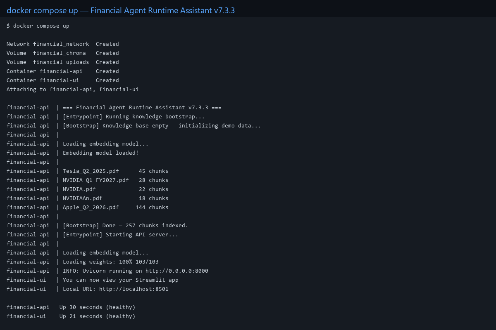
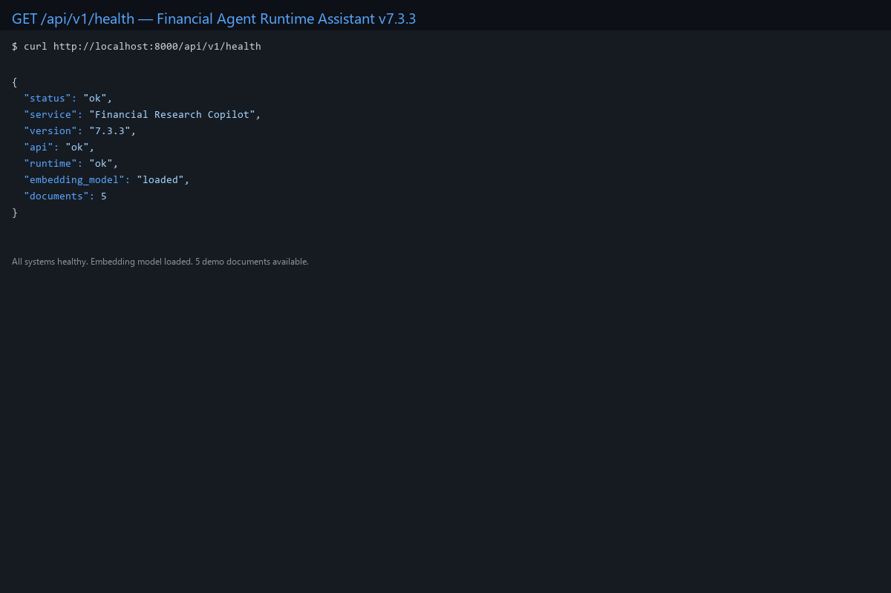
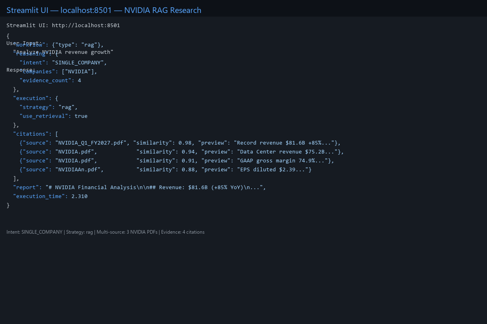
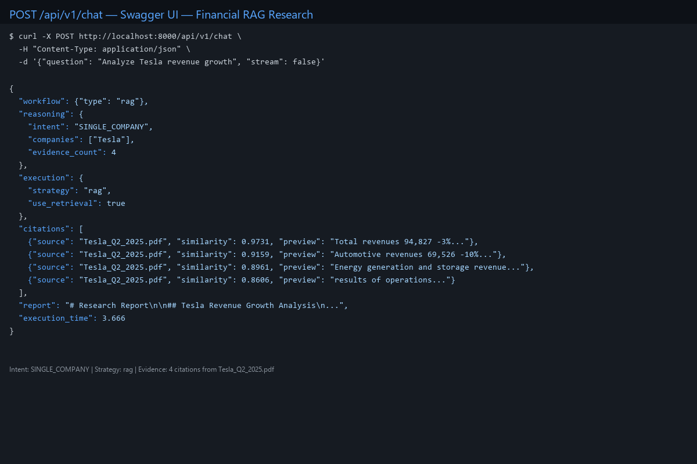

# Financial RAG Assistant v8.1.0

**Release Date:** 2026-07-20

**Tag:** `v8.1.0` (043dc59)

---

## Highlights

Production-ready AI Financial Research Copilot with full-stack Docker deployment.

### Core Capabilities

- **Agentic RAG Workflow** — Intent-driven multi-step research with structured planning
- **React Product UI** — Modern chat interface with agent timeline visualization
- **Knowledge Workspace** — PDF upload, document indexing, and chunk exploration
- **Retrieval Playground** — Hybrid search debugging with transparent similarity scores
- **Citation Experience** — Evidence tracking, source reference, and confidence scoring
- **Docker Full Stack Deployment** — One-command production launch with docker compose

---

## Frontend

New React-based Financial Copilot UI built with Vite + TypeScript:

- **Chat Copilot Interface** — Real-time conversation with agent reasoning display
- **Agent Timeline Visualization** — Step-by-step execution trace with intent and strategy
- **Citation Cards** — Inline evidence display with source document and similarity score
- **Document Explorer** — Browse uploaded financial PDFs with chunk-level inspection
- **Retrieval Debug Console** — Query embedding inspection and search result ranking

### Pages

| Page | Route | Description |
|------|-------|-------------|
| Chat | `/` | AI Copilot conversation interface |
| Knowledge | `/knowledge` | Document upload, indexing, and exploration |
| Retrieval | `/retrieval` | Hybrid search debugging and analysis |

---

## Screenshots

### Chat Interface



The AI Copilot chat interface with agent reasoning display, citation cards, and real-time conversation flow.

### Knowledge Workspace



PDF upload, document indexing, and chunk-level exploration for financial research documents.

### Retrieval Playground



Hybrid search debugging with similarity scoring, query embedding inspection, and result ranking.

### Agent Timeline



Step-by-step execution trace showing intent detection, query planning, strategy selection, and workflow execution.

---

## Demo Workflow

A typical financial research session flows through six stages:

```
1. Upload Financial PDF
   │  Drag-and-drop quarterly reports, earnings transcripts, or SEC filings
   │
   ▼
2. Document Indexing
   │  Automatic chunking, embedding generation, and vector storage
   │
   ▼
3. Ask Financial Question
   │  "Analyze Tesla's Q2 2025 revenue growth and margin trends"
   │
   ▼
4. Agent Planning
   │  Intent detection → Query decomposition → Strategy selection
   │
   ▼
5. Hybrid Retrieval
   │  Semantic search + keyword matching → Evidence collection
   │
   ▼
6. Citation Generation
      Research report with inline citations, source attribution, and confidence scores
```

---

## Technical Highlights

### Agent Runtime Architecture

Full Agent Runtime with Intent Router, Query Planner, Strategy Engine, and Workflow Executor. Supports multiple execution strategies: RAG, Direct LLM, Parallel, MultiStep, and Tool Calling. Each execution produces structured reasoning (Facts, Risks, Opportunities) with an explainable evidence pipeline.

### LLM Provider Abstraction

Factory pattern for clean provider separation: `ProviderFactory.create(config)` → `ProviderRegistry.get(name)` → `BaseProvider.chat()`. DeepSeek in production, Gemini and Claude supported via registered adapters. SDK calls are fully decoupled from business logic.

### Hybrid Retrieval

Dual-path retrieval combining semantic embeddings (sentence-transformers) with keyword matching (BM25). Configurable weights, transparent similarity scoring, and per-chunk metadata. Every retrieved chunk is traceable with source document and confidence score.

### Docker Full Stack Deployment

One-command `docker compose up -d` launches three services: React + Nginx frontend, FastAPI + Uvicorn backend, and ChromaDB vector store. Multi-stage Docker builds, health checks with `start_period`, nginx reverse proxy with SPA fallback, and named volumes for persistent data.

---

## Backend

Stable FastAPI backend with full agent capabilities:

- **FastAPI 0.115** — RESTful API with auto-generated Swagger documentation
- **Agent Runtime** — Intent routing, query planning, multi-strategy execution
- **Hybrid Retriever** — Semantic embeddings + keyword search with configurable weights
- **ChromaDB 0.6.3** — Persistent vector store with health check
- **LLM Provider Abstraction** — DeepSeek (Production), Gemini (Supported), Claude (Reserved)

---

## Deployment

One-command full-stack deployment:

```bash
docker compose up -d
```

### Services

| Service | Container | Port | Description |
|---------|-----------|------|-------------|
| frontend | React + Nginx | 3000 | SPA with API proxy |
| backend | FastAPI + Uvicorn | 8000 | REST API server |
| chromadb | ChromaDB | 8001 | Vector store |

### Docker Features

- Multi-stage builds for frontend and backend
- Health checks with proper `start_period` for slow-start services
- Nginx reverse proxy with SPA fallback and `/api/` proxy
- Named volumes for persistent data (ChromaDB, uploads, logs)
- Production-ready `.env.example` configuration

---

## CI/CD

- **pytest** — 1000+ tests with >= 85% coverage
- **GitHub Actions** — Full-stack validation on every push and PR
- **Docker Build Validation** — Frontend + backend image build verification
- **Quality Gates** — Ruff formatting, mypy type checking, flake8 linting

---

## What's Changed

### v7.3.3 → v8.1.0

- README productization with badges, features, architecture, and quick start
- Docker health check optimization with `start_period` for slow-start services
- Frontend API routing via nginx reverse proxy with `VITE_API_BASE_URL=/api`
- Production-ready configuration `.env.example`

### Full Changelog

See [CHANGELOG.md](../../CHANGELOG.md) for the complete version history.
